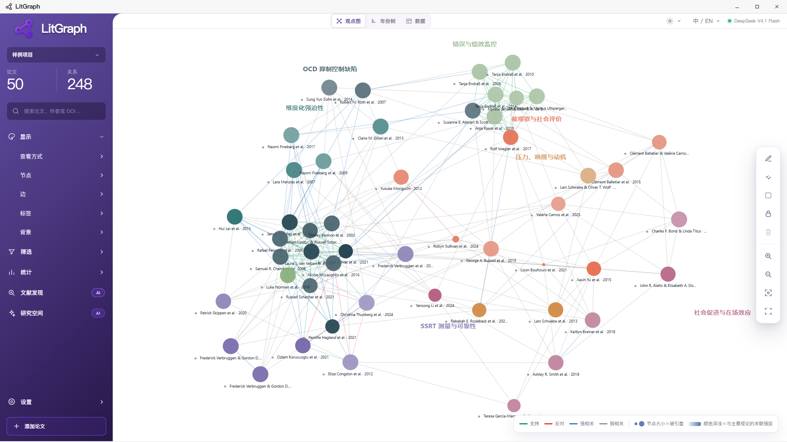
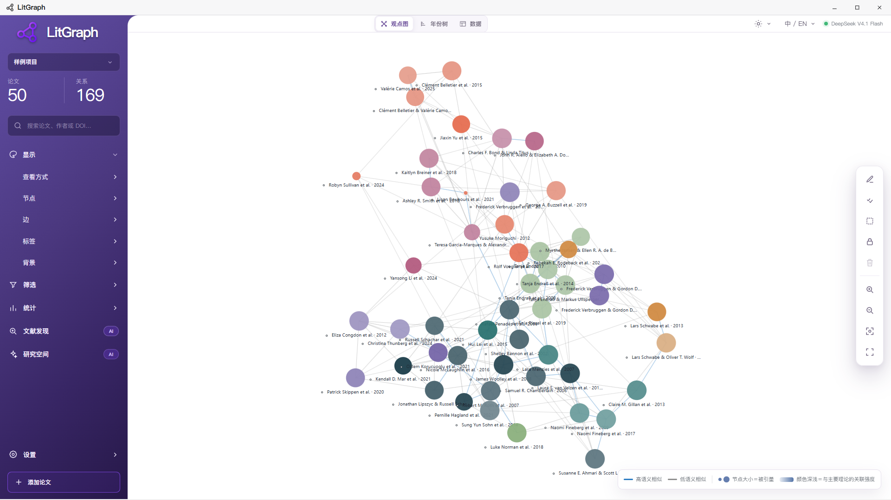
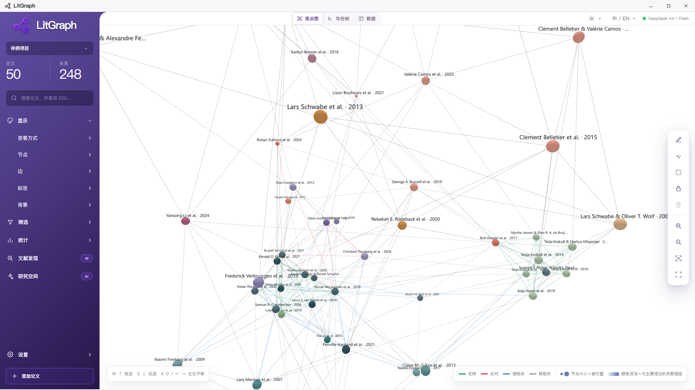
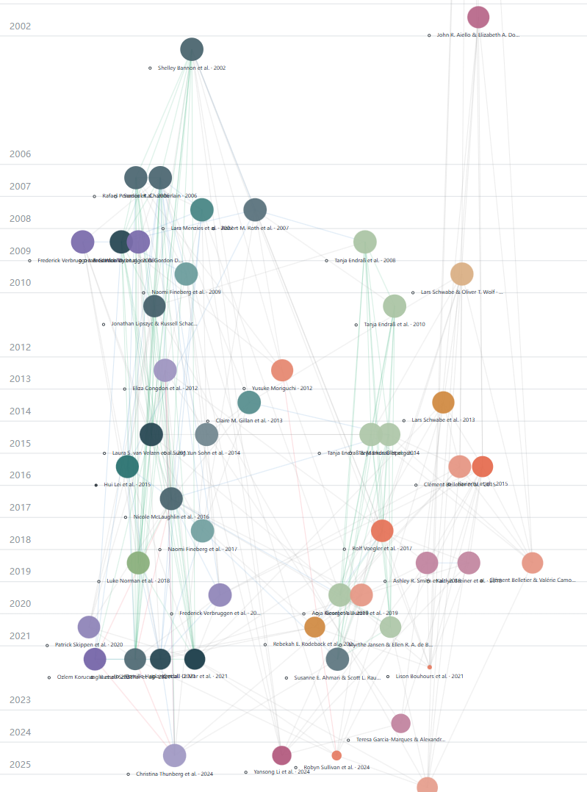
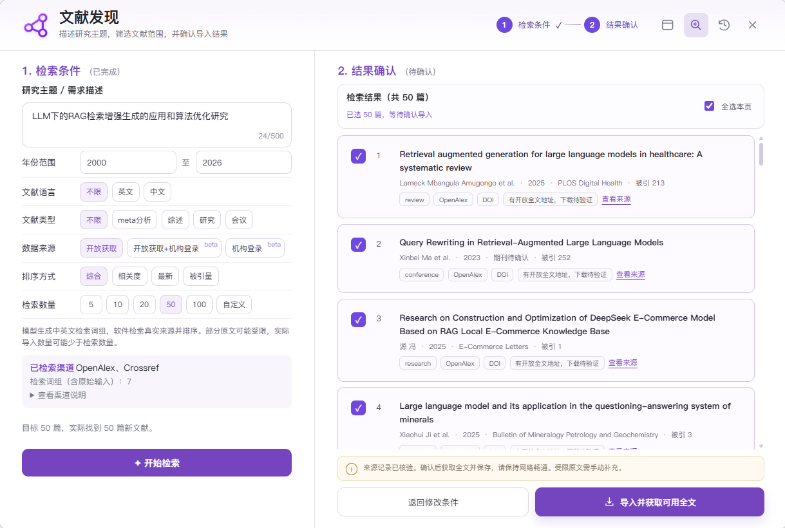
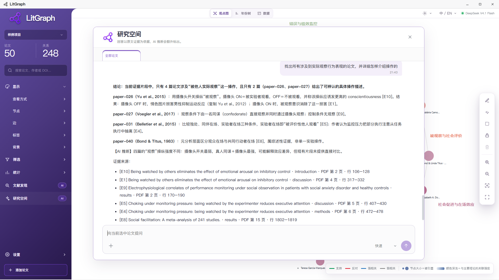
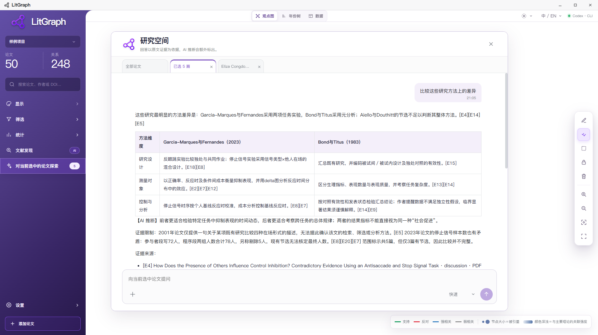
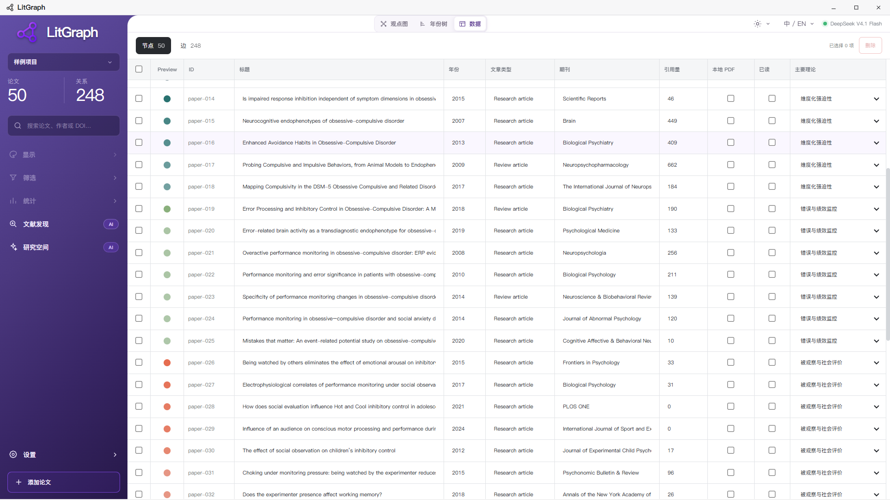
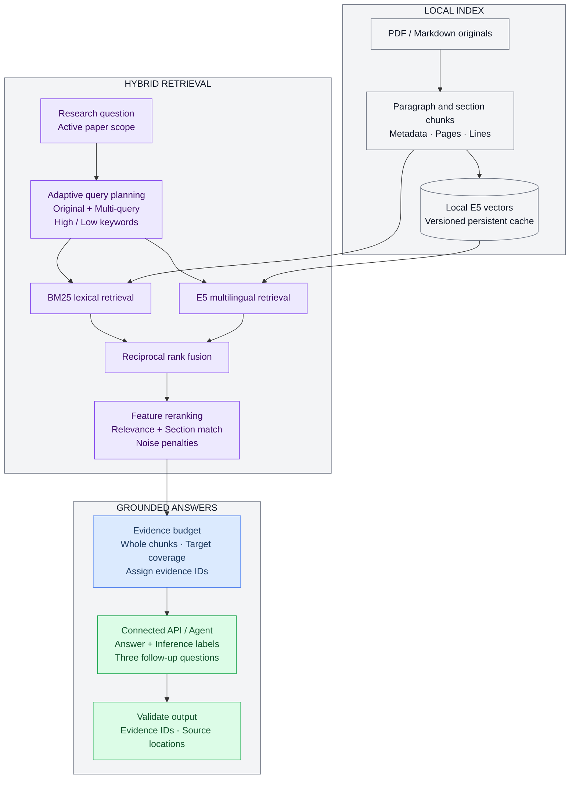

 

# LitGraph

1.3.0 gives Quick answers more substance and preserves usable Expert answers when optional follow-up formatting fails. Available for Windows and Apple Silicon macOS. See [release notes](RELEASE_NOTES.md).

_Connect the literature. Follow the evidence._

Reading builds a collection. Research builds an understanding: which papers address the same question, where their findings converge, why they disagree, and what is worth asking next.

LitGraph is a desktop workspace for literature reviews, theoretical comparison, and research exploration. It brings **scholarly discovery, interactive graphs, and source-grounded conversations** into one workflow. Start with a collection of papers, explore its structure, then ask focused questions about one paper, a selection, or the entire project.

See the relationships in the graph. Investigate them in conversation. Your papers and research materials stay on your device, while AI comes from your chosen model API or an external Agent connected through MCP.

**1.3.0 · Windows 10 / 11 x64 · macOS 13+ (Apple Silicon M series) · MIT licensed**

> Fixes sample index preparation and cross-turn evidence IDs. Sources display up to 24 original opening words, with `...` for longer excerpts; originals shorter than ten words are shown fully, never padded. Unknown citations are explicitly marked unverified, never mapped to unrelated sources. Version history lives in the [changelog](RELEASE_NOTES.md).

[Download](https://github.com/AOBI8001/LitGraph/releases/latest) · [Website](https://litgraph.aobi.qzz.io/) · [Feedback](https://github.com/AOBI8001/LitGraph/issues)

---

## 📍 Contents

- [Download and get started](#-download-and-get-started)
- [Product tour](#product-tour)
- [From a research question to a paper collection](#-from-a-research-question-to-a-paper-collection)
- [Explore the structure of the literature](#-explore-the-structure-of-the-literature)
- [Research conversations grounded in source text](#-research-conversations-grounded-in-source-text)
- [Choose your AI](#-choose-your-ai)
- [RAG, layout algorithms, and optimizations](#algorithms)
- [Data and privacy](#-data-and-privacy)
- [Frequently asked questions](#-frequently-asked-questions)
- [Documentation and open-source collaboration](#-documentation-and-open-source-collaboration)

## 📦 Download and get started

### Install

1. Open [GitHub Releases](https://github.com/AOBI8001/LitGraph/releases/latest).
2. Choose **Download for Windows**, or your chip under **Download for macOS**.
3. Run the Windows `.exe`; on macOS open the `.dmg`, drag LitGraph into Applications, then launch it from Applications.

Installers include the runtime, 50-paper sample and offline embedding model; no separate Node.js or Python is needed. The macOS 13+ package supports Apple Silicon M-series (arm64) only; no Intel Mac build is distributed. See [macOS instructions](docs/MACOS.md). LitGraph is free to use. Model usage charges and subscription access are governed by the providers you choose.

> ⚠️ **Installation notice:** Official installers are unsigned. Windows may display an unknown-publisher or SmartScreen warning. Use the files published in this repository and compare the installer checksum with `SHA256SUMS.txt` from the same release. Keep system security protections enabled.

> macOS builds are ad-hoc signed, not Developer ID signed or Apple-notarized. After verifying the source and checksum, follow [Apple's per-app approval instructions](https://support.apple.com/en-au/102445) in Privacy & Security; do not disable system-wide protections.

### Your first project

The application opens with a blank project and four starting points:

| Entry | Purpose |
| --- | --- |
| **Model connection** | Connect an Agent or API |
| **Sample data** | Explore a 50-paper graph |
| **Literature discovery** | Search from a research topic |
| **Choose paper files** | Import existing research materials |

Load the sample to learn the graph, then create your own project. It contains 50 paper nodes with theory-category colors; two nodes refer to the same paper. Builds with the optional Markdown corpus support source-grounded questions without PDF files. Builds without that corpus indicate missing originals. Article full text is not published in the source repository; see [sample corpus documentation](docs/SAMPLE_CORPUS.md).

### A complete workflow

1. **Create a project:** Name your research topic and connect AI.
2. **Collect papers:** Use Literature discovery or import existing PDF / Markdown materials.
3. **Review the materials:** Check candidate records, metadata, and full-text availability.
4. **Explore the structure:** Switch between the graph and timeline, choose theory or semantic layouts, and filter papers.
5. **Read more closely:** Open an original from its node, or compare selected papers in Research space.
6. **Follow the questions:** Continue with specific follow-ups and return to the saved project as your research develops.

The project menu supports creation, switching, renaming, and deletion. Project JSON supports graph-data exchange; transferring a complete research collection also requires its associated originals and indexes.

## Product tour

Eight actual interfaces show the workflow from graph exploration to source-grounded questions. Click an image to view the original; answers depend on project sources, retrieved evidence and the connected model.

<table>
  <tr>
    <td width="50%" align="center" valign="top">
      
<strong>2D theory clusters</strong>

      
    </td>
    <td width="50%" align="center" valign="top">
      
<strong>2D semantic layout</strong>

      
    </td>
  </tr>
  <tr>
    <td width="50%" align="center" valign="top">
      
<strong>3D theory clusters</strong>

      
    </td>
    <td width="50%" align="center" valign="top">
      
<strong>2D timeline</strong>

      
    </td>
  </tr>
  <tr>
    <td width="50%" align="center" valign="top">
      
<strong>Literature discovery: search and confirmation</strong>

      
    </td>
    <td width="50%" align="center" valign="top">
      
<strong>Research space: project-wide factual retrieval</strong>

      
    </td>
  </tr>
  <tr>
    <td width="50%" align="center" valign="top">
      
<strong>Research space: selected-paper comparison</strong>

      
    </td>
    <td width="50%" align="center" valign="top">
      
<strong>Paper and relationship data table</strong>

      
    </td>
  </tr>
</table>

## 🔍 From a research question to a paper collection

### Search by research intent

Literature discovery places search conditions and result review in one window. Describe the question, population, method, or evidence you want, then set the scope. For example:

> Find English-language empirical studies on how generative AI affects university students' critical thinking, focusing on experimental design, intervention duration, and measurement methods.

Available conditions include:

- **Year range:** Enter inclusive start and end years.
- **Language:** Any, English, or Chinese.
- **Article type:** Any, meta-analysis, review, research, or conference.
- **Access source:** Open access, Open + institution (beta), or Institution sign-in (beta), in that order.
- **Search count:** 5, 10, 20, 50, 100, or a custom integer from 5–100; the default is 20.
- **Sorting:** Combined, relevance, newest, or citations.

The count is a target number of candidate records. Filters, source coverage, and network availability determine how many can actually be retrieved. The interface reports the actual result count. Combined sorting uses keyword matching and source ranking.

### Real sources and AI search planning

The original input is searched first. AI adds 2–3 English and 2–3 Chinese topic combinations, together with bilingual core subject terms. LitGraph retrieves real source records, checks title/abstract topic matches, filters, deduplicates and ranks them. Exact full-title matches have priority; unrelated papers are not used to fill the count. The completion area lists the channels used, and project history retains each query’s outcome and channel warnings. Authors, titles, DOIs, abstracts and citation counts retain their source values. Results are not sent for an extra AI critique.

| Channel | Role in the workflow |
| --- | --- |
| **OpenAlex** | Primary search and scholarly relationships |
| **Europe PMC** | Supplementary search and full-text leads |
| **Crossref** | DOI metadata and reference enrichment |

Results pass through filters and DOI/title-based deduplication, excluding papers already in the project. Records with an unconfirmed language or type cannot pass the corresponding strict filter. Chinese-language coverage depends on source indexing. Institution mode searches the saved library catalogue or publisher page in its existing signed-in session. Combined mode merges public-source and institution-page results. The browser icon in the discovery header opens the existing institution window.

### Review, acquire, and link originals

Inspect the sources and access status, select the papers you want, and confirm acquisition and import. Candidates enter the project only after confirmation.

For each selected paper, the application performs the available steps:

1. Enrich the complete available author list, journal, year, DOI, abstract, and references.
2. Acquire a lawful open PDF first. In institution or combined mode, try the existing authenticated browser session when an open original is unavailable, then save the original.
3. Extract readable text into a Markdown index with physical PDF page markers.
4. Bind the original and index to the paper node, connecting the Original action and Research space to the same material.
5. Match source reference identifiers against papers in the project to establish citation edges.
6. Generate a summary, subject classification, and support/opposition/related edges grounded in both supplied original texts, then update the canvas.

A failed acquisition preserves the bibliographic record and its status while other papers continue. Pause and resume unfinished stages without redownloading saved PDFs or reconverting saved Markdown. Editing filters preserves current results; Start search creates a new search. The history button tracks acquisition, Markdown conversion and analysis separately, including after a restart. Convert locally and analyze in the paper details retries one paper independently.

**Large imports and resuming (1.2.1):** Pause, change API or external Agent configuration, then Continue. Disk records are reconciled first; existing Markdown is analyzed before retrying pending conversions. Each successful stage is saved separately. Desktop workspace persistence is no longer limited by Chromium's approximately 5 MB localStorage cache quota. Memory, disk and model-context limits still apply.

**Redraw canvas**, between Continue and Expand in history, recalculates the layout and hides unanalyzed gray nodes from that import. It does not delete papers, PDF/Markdown files, analyses or history. Continue restores those nodes. Collapsed history retains all three progress bars and creates per-paper detail rows only when expanded. PDF conversion now ships local character maps and font resources; scans and damaged encodings may still need OCR or replacement source text. Unreliable extraction is not silently treated as success.

Original opens in the default Windows application, with the system application picker when no association exists. LitGraph does not embed a PDF reader. Obtain restricted originals through an authorized institutional route and add them afterward. Unrestricted-language searches prioritize English, supplementing other languages when English sources are insufficient.

### Institution access beta and automatic skipping

Institution features are in testing. Signing in does not imply a subscription to every paper or compatibility with every catalogue, proxy or publisher.

1. Select institution or combined mode and enter a publisher, institution or library URL.
2. Complete sign-in and any manual verification in the built-in browser, then select **Save session & close**.
3. Search and acquisition reuse that browser session. Cookies are never provided to AI.
4. If verification returns during acquisition, the window is brought forward and automation pauses. Save after completing verification; the stable article resumes without a reload.
5. **Each paper has a cumulative two-minute manual-wait budget.** Expiry skips that paper; an explicitly detected site block skips it immediately. The queue advances, history records the reason, and saved PDFs, Markdown and analyses are retained.
6. Choosing **Pause** yourself stops the batch; it is distinct from automatic skipping. Resume from history later or supply an authorized original.

Institution search also has a two-minute manual verification limit, after which that channel ends with existing results retained. Combined search keeps completed public results. Session expiry, IP restrictions, verification and subscription entitlement remain controlled by the website.

### Understand the bibliographic fields

The full available author list is preserved in the data. Compact canvas labels show one author, `A & B` for two authors, or the first author followed by `et al.` for three or more.

Abstracts come from source-provided abstract fields. Citation counts retain their source and retrieval time, with missing values left unknown. A formatted citation for a paper, the references it cites, and the number of citations it has received are three separately handled kinds of information.

## 📊 Explore the structure of the literature

### Two ways to see the collection

| View | Research question |
| --- | --- |
| **Graph** | Which topics and theories connect papers? |
| **Timeline** | How does the research develop over time? |
| **Data panel** | Which records match specific fields? |

The graph and timeline both support 2D / 3D. Theory layouts organize papers around project categories and relationships; semantic layouts use title-and-abstract text similarity to organize neighboring papers. The timeline adds publication time to reveal connections between earlier and later work.

### Nodes and edges

- **Nodes** represent papers, with titles, authors, years, abstracts, AI summaries, and original-file status.
- **Category colors** identify theories; shading can encode the theoretical association strength stored in the data.
- **Node size** can map citation counts, with controls for overall size and variation.
- **Semantic relationships** can express support, opposition, and relatedness; **citation edges** come from source-reference matches.

These visual encodings support browsing and comparison. A citation alone does not establish agreement; theoretical classifications and relationship interpretations should be read alongside the source text.

### Interaction for focused reading

Hover to inspect a paper label. Click to open its details and emphasize its connections. Clicking the same node again clears the selection; in single-selection mode, clicking another node replaces the selected paper.

Multi-select and box selection create a set of papers to investigate. The research entry reflects that selection and carries it into Research space. Leaving either selection mode, or changing views and spatial layouts, clears the current selection.

In every 3D view, left-drag on the background rotates the model without modifier keys (bounded observation angles in the timeline). Right-drag pans the scene in the pointer's direction. Use the wheel to zoom and arrow keys or `WASD` to move the camera; a canvas legend explains the controls. The toolbar also offers node renaming, position locking, fit-to-canvas, and fullscreen browsing.

### Filters and reading progress

Combine year, journal/source, original-file availability, primary-theory, and relationship filters with title, author, or DOI search. The statistics panel summarizes the visible papers, relationships, journal sources, full-text availability, and read/unread progress to help plan the next reading session.

### A configurable workspace

The interface supports Chinese and English, day and night themes, and eight independent canvas backgrounds: white, black, purple stardust, ivory paper, soft pink, lavender, lagoon, and dark cosmos. Switching the application theme restores its corresponding plain background; you can then choose another canvas background independently.

Literature discovery and Research space share a floating-window design with dragging, edge resizing, and close controls. Original paper titles and abstracts retain their source language. With a model connected, AI summaries can obtain and cache translations for the selected interface language.

## 💬 Research conversations grounded in source text

### Set the scope of a question

Research space supports a single paper, selected papers, or all papers in the project, with separate conversation tabs. Each request captures its paper scope when sent, keeping later selection changes from mixing other materials into that request.

For example:

- “Does this paper's design support the causal explanation given by its authors?”
- “How do the outcome measures differ across these studies?”
- “Which findings agree, and which differences might follow from the samples or tasks?”
- “What additional evidence would be needed to answer this question?”

### Source text first, explicit inference

The application prioritizes indexed originals, retrieves relevant passages, and sends them to the model with per-paper coverage information. Answers are instructed to follow that evidence. Further AI deductions must be marked `[AI inference]`, or `【AI 推断】` in Chinese.

Factual answers are instructed to cite retrieved evidence IDs, linked to available sections, PDF pages or Markdown lines for source checking. Missing full text, extraction problems and conflicting evidence should be described specifically.

Selecting all papers sets the retrieval scope; each request still has a finite context budget. Relevant excerpts and coverage information distinguish the evidence supplied for this answer from material that remains unverified.

### Quick and Expert

| Preference | Emphasis |
| --- | --- |
| **Quick** | Relevant evidence and a direct answer |
| **Expert** | Methods, disagreements, and limitations |

Both preferences follow the same evidence requirements. They adjust context budgets and response guidance; compatible providers may also receive supported reasoning controls. Waiting time depends on the model, material volume, and provider load.

### A continuous conversation

- `Enter` sends; `Shift + Enter` adds a line.
- During processing, elapsed time is shown and the send control becomes Stop.
- After stopping, you can resubmit the previous question; a new draft sends a new question.
- Cancelled and failed answers do not enter subsequent context as successful responses.
- Each valid answer is required to provide three specific, short follow-up questions. Click one to continue.
- Drag materials into the conversation; images require vision support from the connected model and client.

## 🔌 Choose your AI

### Option 1: Model API

Call a model directly from the product. Enter the service address, API key, and model name, then use Test & save. Enable image support according to the provider's actual capabilities.

Supported protocols include OpenAI-compatible Chat Completions, OpenAI Responses, and Anthropic Messages. Services implementing those protocols can be configured; model availability, permissions, and quotas are controlled by each provider.

LitGraph supplies scholarly search, acquisition, text conversion, and file association. The model supplies search planning, original-paper analysis, and research answers. API mode supports the same workflow, with model configuration encrypted using operating-system facilities.

### Option 2: External Agent

Use your Codex CLI or Claude Code account. The desktop app starts independent tasks on demand for search planning, imported-paper analysis and research questions. Processes exit after completion; no persistent chat task is required.

1. Install the official native Codex CLI or Claude Code and sign in once in that tool.
2. In Model connection, choose the tool and select Connect & verify. Use Choose executable if automatic detection fails.
3. After verification, search, analyze and ask questions in LitGraph using that tool's account quota.
4. Restarting LitGraph reuses your selection and CLI login. If authentication expires, sign in again and reconnect.

LitGraph does not take over existing conversations or copy CLI credentials. Network availability, quotas and CLI versions still affect execution. The current on-demand path accepts text only. See [on-demand agent execution](docs/on-demand-agent.md). Other clients can use the advanced manual MCP option if they support ongoing task processing.

### How MCP coordinates the work

Manual MCP is a separate compatibility path: LitGraph prepares questions, evidence and structured requirements; the external client continuously claims tasks and submits results; the application validates and displays them. The following loop does not apply to on-demand CLI execution above.

| Tool | Responsibility |
| --- | --- |
| `litgraph_connect` | Handshake and capability report |
| `litgraph_context` | Session context and connection renewal |
| `litgraph_next_task` | Wait for and claim a task |
| `litgraph_submit_result` | Return the corresponding result |
| `litgraph_disconnect` | End the connection |

Search planning, source-paper analysis, and research answers each have their own output contract. Connection status reflects recent handshake and tool activity; the Agent must continue claiming tasks to answer new requests. See the [shared Agent guide](docs/LITGRAPH_AGENT_GUIDE.md) for the complete agreement.

## ⚙️ RAG, layout algorithms, and optimizations

### Source-grounded research: A scoped, multi-stage hybrid RAG engine

LitGraph organizes research questions into **document indexing → query planning → hybrid retrieval → evidence reranking → context assembly → grounded generation**. The retrieval unit is a locatable source passage; the active research tab determines the paper scope. Questions, relevant passages and necessary metadata form the model input.

The pipeline supports factual lookup within a paper, comparison across selected studies, and topic exploration across a project. **Document processing, embedding and evidence retrieval run locally. The connected model supplies query planning when needed and the final answer.** API and external Agent connections share the research-answer contract.

### 1. Document modeling: Paragraph structure and source coordinates

Chunking follows Markdown headings, natural paragraphs and PDF page boundaries. Long paragraphs split preferentially at sentence boundaries, falling back to line or word boundaries when necessary, with a cap near **1,400 characters**. This structure-aware approach preserves coherent passages while bounding their size. Section recognition covers abstracts, introductions, methods, results, discussions, limitations and conclusions.

Each evidence chunk carries both searchable text and provenance:

| Metadata layer | Stored fields | Purpose |
| --- | --- | --- |
| **Paper identity** | Document ID, title, authors, year, DOI | Associate passages with papers and support explicit targeting |
| **Semantic structure** | Section category, current heading, passage text | Distinguish methods, results and discussion; supply ranking features |
| **Source coordinates** | Source type, filename, Markdown path, PDF page, line and character ranges | Locate the answer's evidence in the original |
| **Index version** | Content fingerprint, chunking version, chunk ID | Track changes and keep evidence versions separate |

Page references use retained **physical PDF file pages**. Markdown lines provide a fallback when pages are unavailable; publisher-printed page numbers are never invented. Papers without readable full text may contribute explicitly labeled abstract evidence, with that limitation passed to the model.

### 2. Query planning: Preserve intent and separate retrieval targets

Question intent is retained; full titles identify the source scope while search text focuses on the requested facts rather than repeating long titles. Model-planned requests use bounded recent user questions and explicitly mentioned paper metadata, requesting two to three supplementary queries and up to six concrete terms (with support for the older two-level keyword format):

- **High-level keywords:** themes, relationships and comparison axes, such as “reliability of inhibitory-control measurement.”
- **Low-level keywords:** tasks, constructs, measures, populations or authors, such as “stop-signal task, SSRT, test–retest reliability.”
- **Section preferences:** relevant section categories for questions about samples, designs or statistical findings.

Planning preserves negation, temporal constraints, comparison targets, exact titles and DOIs, with cross-language expressions where useful. It produces retrieval cues rather than answers or guessed findings. Explicit title or DOI matches further restrict the candidate papers; query expansion does not expand the active paper scope.

**Simple conceptual questions in Quick mode use local bilingual expansion without a separate remote planning call.** Precise facts, explicitly named papers, comparisons and Expert requests use compact, deadline-bounded planning. Failures retain local expansion and the fact-query evidence budget with a visible fallback notice. Quick dense retrieval has a 1.2-second budget for simple single-paper questions and 3.5 seconds otherwise, falling back to lexical retrieval when unavailable or late. These are dense-retrieval budgets, not end-to-end answer guarantees.

### 3. Hybrid retrieval and reranking: Exact terminology meets semantic matching

Two complementary paths retrieve chunks within the active scope:

| Stage | Current implementation | Purpose |
| --- | --- | --- |
| **Sparse retrieval** | BM25 with `k1=1.2, b=0.75` | Preserve exact task names, abbreviations and term matches |
| **Dense retrieval** | Local `multilingual-e5-small`, 384-dimensional normalized vectors, cosine similarity | Capture semantic proximity and multilingual expressions |
| **Rank fusion** | Top 60 candidates per query/ranking, RRF with a smoothing constant of 60 | Combine rankings with different score scales |
| **Feature reranking** | Fused, lexical and dense scores plus section features | Prioritize passages suited to the current question |

E5 runs with quantized weights on the local CPU. Queries and passages use the required `query:` and `passage:` prefixes, followed by mean pooling and L2 normalization. Encoding is capped at 512 tokens; chunk character limits and encoder token limits are separate controls.

RRF combines ranks rather than adding raw retrieval scores: each ranking contributes `1 / (60 + rank)`. The lightweight reranker starts with **45% normalized fusion score + 35% lexical score + 20% best dense similarity**, adds a requested-section bonus, and penalizes reference sections and very short passages. These engineering weights are ranking signals, not probabilities of answer correctness.

Reranking currently uses this interpretable feature combination; a cross-encoder is not integrated. If dense retrieval is unavailable, lexical retrieval remains available with diagnostics identifying the fallback.

### 4. Evidence assembly: Coverage, completeness and budgets

Fused candidates are deduplicated by chunk ID and selected as **complete passage chunks**, without truncating selected evidence to fill a budget. For explicitly named comparison papers, evidence slots are allocated across targets before remaining capacity is filled by ranked candidates, reducing domination by one paper.

| Request path | Maximum chunks | Source-text budget |
| --- | ---: | ---: |
| Quick · Local expansion · Single paper | 6 | 8,000 characters |
| Quick · Local expansion · Multiple papers | 12 | 12,000 characters |
| Quick · Precise facts / Comparisons · Model planning | 20 | 28,000 characters |
| Expert · Model planning | 24 | 42,000 characters |

Budgets cover evidence text, not the complete request's token count. Required metadata, instructions and bounded conversation history also enter the request. Actual evidence volume depends on passage length, source availability and relevance.

In 1.2.6, precise facts and comparisons get one local coverage pass using query aspects and matching abstracts/lead paragraphs: at most six additional intact chunks and 8,400 additional characters, with a 48,000-character total cap. This pass does not call another model or build passage vectors on demand. It is a coverage heuristic, not exhaustive evidence verification. Query planning has a 16-second deadline and retains the larger fact-query budget on failure. Simple conceptual questions still need only one answer-model call.

### 5. Grounded generation: A shared contract and traceable sources

API and external Agent connections receive the same scope, evidence package and output constraints. Selected chunks obtain request-local IDs such as `E1, E2…`. Paper metadata is supplied per document rather than repeatedly duplicating titles and abstracts inside every passage.

The generation contract requires:

1. Factual claims to cite supplied evidence IDs, with separate support for each paper in a comparison.
2. A distinction between a paper's own findings and prior work it discusses; additional deductions use `[AI inference]` / `【AI 推断】`.
3. Explicit limitations for missing text, extraction quality, conflicting evidence and incomplete coverage.
4. Source documents, attachments and historical text to be treated as data rather than system instructions.
5. A structured result containing a Markdown answer and three concrete follow-up questions, in the question's language.

Before display, output structure and evidence IDs are checked, references to unknown IDs are rejected, and actual sections, pages and line locations are attached. **ID validation makes citations locatable; whether a claim is fully supported still requires reading its source.** All papers defines the candidate scope, not a promise that every full text fits in one request. Coverage information is explicitly provided to the model.

### 6. Performance engineering: Reuse computation and shorten remote work

| Layer | Implemented strategy | Main benefit |
| --- | --- | --- |
| **Query routing** | Local expansion for short Quick questions; planning calls for more demanding requests | Shorter remote-call chains for common questions |
| **Query-plan cache** | Bounded in-memory cache keyed by model identity, question, recent context and paper scope | Reuse plans under the same conditions |
| **Embedding inference** | Quantized local E5, background CPU Worker, model-instance reuse, batches of eight | Keep encoding off the UI thread and reduce repeated initialization |
| **Vector cache** | Memory, disk and bundled sample-vector reuse; model-version, input and dimension checks | Encode cache misses instead of repeatedly processing unchanged text |
| **Input deduplication** | Merge identical encoding inputs within a batch; deduplicate evidence by chunk ID | Avoid repeated encoding and context |
| **Context compression** | Complete-chunk budgets, deduplicated metadata, bounded recent history | Control request size and leave room for the answer |
| **Request lifecycle** | Pause/cancel, scope snapshots, late-result isolation | Keep older requests from overwriting newer conversations |
| **Stage diagnostics** | Queries, candidate counts, retrieval timing, evidence volume and fallback states | Separate document preparation, retrieval and generation costs |

Caches reuse plans or vectors; evidence is selected for the current question. End-to-end latency also includes model startup, time to first output, answer length, network conditions and account limits. Local retrieval optimization alone cannot guarantee a fixed response time. See [research latency and the Quick path](docs/RESEARCH_LATENCY.md).

### 7. Incremental updates, evaluation and scaling boundaries

Historical model measurements: [1.2.6 quality/latency report](docs/RAG_BENCHMARK_1.2.6.md), with 97.75% reference recall, 100% strict necessary-fact accuracy and 20.60-second backend median on a known regression set. These do not measure the new 1.2.8 scope-coverage workflow or guarantee accuracy for other corpora/models.

In 1.2.8, scoped overviews use one source-backed aim card per paper. Comparison and screening retrieve inside each paper rather than competing for global top-K. New imports collect card quotations in the existing analysis call; old sources get local extractive cards on access, without another model call. Large scopes use bounded batches and hierarchical synthesis with explicit coverage/uncertainty. A retrieval miss is not absence, and locally selected card excerpts are candidates, not independently verified semantic annotations. See [coverage design and limitations](docs/RESEARCH_COVERAGE_1.2.8.md).

Saving Markdown automatically queues versioned passage vectors, merges short same-page/same-section fragments and checkpoints progress. Startup backfills older projects and resumes unfinished indexes; no Research-space indexing button is needed. Queries use ready vectors without embedding the collection on demand. Editing a source changes relevant chunk identities; unchanged inputs reuse cached vectors. Requests stay within the active project scope; hidden nodes do not re-enter answers through retained disk vectors.

Evaluation separates **target-evidence recall, factual answer correctness, source locations and refusal boundaries**. The current regression protocol uses 49 distinct papers from the sample project, with 49 single-paper factual questions, 20 cross-paper comparisons, and duplicate-record and unanswerable controls. It supports implementation regression checks; independent-corpus generalization, human review and new questions remain important. See the [research RAG evaluation protocol](docs/RAG_BENCHMARK_V2.md).

Dense similarity currently scans scoped candidates, and lexical statistics are computed for the current candidate set. Disk-backed inverted indexes, approximate-nearest-neighbor retrieval and hierarchical graph exploration are further scaling directions, not shipped large-corpus capabilities. See [RAG and graph implementation](docs/RAG_AND_GRAPH.md) for architectural details and boundaries.

### Graph algorithms: Theories and text similarity

**Theory layouts** combine category anchors, node repulsion, and link constraints in a force-directed simulation. Positions express structural relationships, with adjustable visual parameters and optional position locking.

**Semantic layouts** extract terms from titles and abstracts, build TF–IDF-style weighted vectors, and use cosine similarity to find neighboring papers. Each paper contributes up to five neighbors above the threshold; duplicate pairs are merged and visual weights normalized. Titles receive additional input weight to emphasize their topics.

**The timeline** maps publication time to a temporal axis, then combines the selected theoretical or semantic relationships with spatial positioning. Citation edges are created when source-reference evidence matches both endpoints within the project.

Graph text vectors organize the collection spatially. Research answers use the source-passage retrieval described above. These mechanisms serve complementary purposes: seeing relationships and finding evidence.

### Optimizations for sustained exploration

- **Clear rendering:** Canvas resolution accounts for display pixel density and page scaling; 3D uses antialiasing and high-resolution text textures.
- **Lightweight hover:** Hover updates paper hints, reserving selection and connection-state changes for clicks.
- **On-demand resources:** 3D resources load when needed, while cached background artwork reduces repeated preparation.
- **Initial framing:** The 3D graph fits model bounds to the viewport on first entry, stopping automatic adjustments when the user takes control.
- **Bounded retrieval:** Candidate limits, pagination bounds, and finite retries contain work; source-ranked results display without additional model calls.
- **Reusable originals:** Saved originals and Markdown indexes can be read again in later conversations.
- **Context allocation:** Per-paper evidence allocation and length limits balance comparison coverage with model cost.
- **Request isolation:** Cancelled, expired, or late results from earlier tasks cannot overwrite a newer request.

## 🔐 Data and privacy

Projects, conversations, and saved originals primarily reside on your device. Model configuration is stored separately with encryption. Graph browsing and management of existing materials operate on-device; online discovery and remote-model answers require network access and the relevant service permissions.

Remote-model requests include the question, necessary metadata, relevant source excerpts, and attached materials. External Agent mode passes corresponding tasks to the Agent you choose. Consider your rights to use the papers and the provider's data policies when selecting a processing route.

The official desktop app includes minimal usage reporting: a random installation ID, random event ID, launch/use type, and timestamp, used for first-use, active-installation, and operation counts. Events contain no papers, conversations, API keys, file paths, or hardware identifiers. A disabled preference saved by an earlier version remains effective. See [Privacy](PRIVACY.md).

Back up the project together with associated originals and indexes. Normal uninstallation preserves user data; migration to another device may require model credentials to be configured again. Updates are currently installed by downloading a newer installer.

## 💡 Frequently asked questions

### Why was a paper found but its full text not downloaded?

Searchable metadata and downloadable full text have different access conditions. LitGraph acquires lawful open versions; login requirements, publisher restrictions, or broken links may leave a metadata-only record. Obtain the original through an authorized route and import it to complete the materials.

### Does entering an institutional library URL grant subscription access?

Saving a library URL opens a separate institution browser window in the desktop app. Complete sign-in and verification there; saving the URL is not a successful login. LitGraph tries open-access full text first, then uses that session for authorized originals. When manual steps are needed, download the PDF on the institution page; LitGraph receives it and continues conversion and analysis. Sessions stay on this device and are never given to models or Agents. VPN requirements and platform restrictions may require user action; API or Agent access does not expand subscription rights.

### Why does an answer mention abstract-only evidence?

The paper may lack readable full text, or PDF extraction may not have succeeded. Check its original/index status and supply the missing material. Scanned PDFs need OCR first; complex tables, formulas, and multi-column layouts may also require checking against the original.

### Can I use only an API, without an external Agent?

Yes. Search tools, acquisition services, and original-text indexing are supplied by the application. Both AI connection routes can use the workflow. The model must still support the selected protocol, context size, and structured response requirements.

### Why can Expert take longer?

Expert provides a larger evidence budget and emphasizes deeper comparison. Choose Quick, narrow the paper scope, or split a broad question into focused requests. Provider rate limits and model load also affect response time.

## 📚 Documentation and open-source collaboration

| Topic | Document |
| --- | --- |
| **Architecture and data flow** | [System architecture](docs/architecture.md) |
| **Discovery and import** | [Literature discovery contract](docs/literature-discovery-agent-spec.md) |
| **Evidence and answers** | [Research space RAG contract](docs/research-space-rag-agent-spec.md) |
| **Agent integration** | [Shared MCP guide](docs/LITGRAPH_AGENT_GUIDE.md) |
| **Project interchange** | [Data contract](docs/agent-data-contract.md) |
| **Visual behavior** | [Canvas, themes, and language](docs/canvas-backgrounds-and-language.md) |
| **Security and privacy** | [Security](SECURITY.md) · [Privacy](PRIVACY.md) |

Report problems and feature ideas through [Issues](https://github.com/AOBI8001/LitGraph/issues), or follow the [contribution guide](CONTRIBUTING.md) to participate. Redact keys, connection credentials, and private research materials from reports.

Original LitGraph code and documentation use the [MIT License](LICENSE), allowing use, modification, and redistribution. Third-party components retain their own licenses, and papers retain their original rights. See [Third-party notices](THIRD_PARTY_NOTICES.md).
