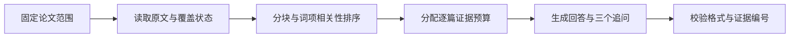

 

# LitGraph

_让论文彼此连接，让研究循证展开。_

阅读积累的是文献，研究需要的是理解：哪些工作讨论同一个问题，哪些结论相互支持，分歧来自理论、方法还是样本，以及下一步值得追问什么。

LitGraph 是一款面向文献综述、理论比较与研究探索的桌面工作台。它将**文献发现、关系可视化与原文问答**串联起来，让你从一批论文出发，建立可操作的研究图谱，再围绕单篇、多篇或整个项目展开有依据的分析。

在图谱中看见结构，在对话中深入问题。论文与研究资料保存在你的设备上，AI 可以来自你选择的模型 API，也可以是通过 MCP 接入的外部 Agent。

**1.0 · Windows 10 / 11 x64 · MIT 开源**

[下载安装包](https://github.com/AOBI8001/LitGraph/releases/latest) · [产品网站](https://litgraph.aobi.qzz.io/) · [反馈与建议](https://github.com/AOBI8001/LitGraph/issues)

---

## 📍 阅读导航

- [下载与开始使用](#-下载与开始使用)
- [从研究问题到文献集合](#-从研究问题到文献集合)
- [把文献组织成可探索的图谱](#-把文献组织成可探索的图谱)
- [围绕原文展开研究对话](#-围绕原文展开研究对话)
- [选择你的 AI](#-选择你的-ai)
- [RAG、布局算法与优化策略](#algorithms)
- [数据与隐私](#-数据与隐私)
- [常见问题](#-常见问题)
- [文档与开源协作](#-文档与开源协作)

## 📦 下载与开始使用

### 安装

1. 前往 [GitHub Releases](https://github.com/AOBI8001/LitGraph/releases/latest)。
2. 在附件中下载 `LitGraph-Setup-1.0.0-x64.exe`。
3. 运行安装程序，选择安装位置，完成后打开 LitGraph。

安装包包含应用所需的运行环境，无需另外安装 Node.js 或 Python。当前提供 Windows x64 版本。软件使用免费，远程模型调用费用及订阅权限由你选择的服务提供方决定。

> ⚠️ **安装提示：** 1.0 安装包尚未代码签名，Windows 可能显示“未知发布者”或 SmartScreen 提示。请使用本仓库发布的文件，并与同一 Release 中的 `SHA256SUMS.txt` 比对校验和；保留系统安全防护。

### 第一次打开

首页从空白项目开始，提供四个入口：

| 入口 | 用途 |
| --- | --- |
| **模型接入** | 连接外部 Agent 或模型 API |
| **样例数据** | 载入 50 篇文献的示例图谱 |
| **文献发现** | 从研究主题开始检索 |
| **选择论文文件** | 导入已有研究资料 |

可以先载入样例熟悉图谱，再创建自己的项目。样例包含公开文献元数据和图谱关系，保留理论分类颜色；全文分析需要对应的可读取原文。

### 一条完整的使用路径

1. **建立项目**：为研究主题命名，连接可用 AI。
2. **收集论文**：使用文献发现，或导入已有 PDF / Markdown 等资料。
3. **确认资料**：检查候选文献、原文获取状态与元数据，再保留需要的内容。
4. **探索结构**：切换观点图与年份树，选择理论或语义布局，筛选相关论文。
5. **深入阅读**：打开节点详情查看原文，或将选中的论文交给研究空间比较。
6. **继续追问**：沿着回答中的具体问题推进，保留项目供后续研究使用。

左上角项目菜单支持新建、切换、重命名与删除项目。项目 JSON 可用于交换图谱数据；迁移完整研究资料时还需一并备份对应原文和索引。

## 🔍 从研究问题到文献集合

### 用研究意图发起检索

文献发现将检索条件和结果确认放在同一个窗口中。你可以描述研究问题、目标对象、方法或希望寻找的证据，再设置范围。例如：

> 查找关于生成式 AI 对大学生批判性思维影响的英文实证研究，重点关注实验设计、干预时长和测量方法。

可设置的条件包括：

- **年份范围**：直接输入起止年份，包含边界年份。
- **文献语言**：不限、英文、中文。
- **文献类型**：不限、元分析、综述、研究、会议。
- **数据来源**：开放获取、机构登录。
- **检索数量**：5、10、20、50、100，或自定义 5–100 的整数，默认 20。
- **排序方式**：综合、相关度、最新、被引。

检索数量表示目标候选记录数。实际结果受筛选条件、数据源覆盖与网络情况影响；界面会展示实际取得的数量。当前“综合”和“相关度”均使用 AI 相关性评分排序。

### 真实来源与 AI 分工

模型将研究意图整理为检索词，LitGraph 向学术来源获取真实记录，再由模型分批判断这些记录与主题的相关性。作者、标题、DOI、摘要及被引量保留来源数据，相关性说明由 AI 生成。

| 数据渠道 | 在流程中的作用 |
| --- | --- |
| **OpenAlex** | 主检索与文献关系信息 |
| **Europe PMC** | 补充检索与开放全文线索 |
| **Crossref** | DOI 元数据与参考文献补全 |

检索结果按条件过滤，并基于 DOI 和标题等信息去重，排除当前项目已有论文。语言或类型无法确认的记录不能通过对应的严格限定。中文文献的可检索范围取决于这些来源的收录情况；机构入口用于引导合法访问。

### 确认、下载与原文关联

检索完成后，你可以查看来源、相关性说明及访问状态，勾选需要的论文，再确认下载并导入。未经确认，候选文献不会直接进入项目。

确认后，软件逐篇完成可执行的处理：

1. 补全来源可提供的完整作者列表、期刊、年份、DOI、摘要和参考文献。
2. 获取合法开放的 PDF，保存原文。
3. 提取可读取文字，生成包含物理页标记的 Markdown 索引。
4. 将原文与索引绑定到对应节点，使“原文”入口及研究空间指向同一份资料。
5. 根据来源参考文献标识，在项目内匹配并建立引用连线。

单篇获取失败时，节点保留文献信息及状态，其他论文继续处理。停止导入会保留已经完成的内容。对于受限全文，可通过机构入口合法取得文件，再补充到研究资料中。

### 理解文献信息

完整作者列表保存在文献数据中；画布为了易读使用缩写：一位作者显示姓名，两位显示 `A & B`，三位及以上显示首位作者加 `et al.`。

摘要使用来源数据库提供的摘要字段。被引量同时保留来源及获取时间，缺失时保留未知状态。论文自身的格式化引用、它引用的参考文献列表，以及它的被引次数，是分别处理的三类信息。

## 📊 把文献组织成可探索的图谱

### 两种观察结构的方式

| 视图 | 适合回答的问题 |
| --- | --- |
| **观点图** | 论文围绕哪些主题与理论聚集？ |
| **年份树** | 研究如何随时间延续和分化？ |
| **数据面板** | 哪些文献符合具体字段条件？ |

观点图和年份树均支持 2D / 3D。理论布局围绕项目中的理论分类与关系组织论文；语义布局根据标题与摘要的文本相似性组织邻近关系。年份树进一步引入发表时间，帮助观察早期工作与后续研究的联系。

### 节点与连线的含义

- **节点**代表论文，可查看标题、作者、年份、摘要、AI 总结及原文状态。
- **分类颜色**对应理论类别；颜色深浅可表达数据中的理论关联强度。
- **节点大小**可映射被引量，并可调节整体大小与差异度。
- **语义关系**可表达支持、反对与相关；**引用关系**来自参考文献匹配。

视觉编码用于浏览与比较。引用关系本身不能证明两篇论文相互支持；理论归类和关系解释仍需结合原文理解。

### 交互与阅读节奏

悬停节点查看信息标签，单击节点打开详情并突出对应连线。再次单击同一节点可取消选择；单选状态下点击其他节点会切换到新的论文。

多选与框选用于建立一组分析对象。选择论文后，左侧研究入口切换为针对当前选择的探索，进入研究空间时携带相应论文范围。退出多选 / 框选模式，或切换视图与空间布局，会清除当前选择。

3D 观点图支持拖动模型围绕自身中心旋转；年份树使用保持时间结构朝向的平移方式，并提供有限角度的旋转。滚轮用于缩放，方向键与 `WASD` 用于移动镜头，画布内提供操作提示。工具栏还提供节点重命名、位置锁定、适应画布和全屏浏览。

### 筛选与阅读进度

按年份、期刊 / 来源、原文是否可用、主要理论和关系类型组合筛选，配合标题、作者或 DOI 搜索缩小范围。统计面板提供当前可见论文、关系、期刊来源、全文数量及已读 / 未读进度，便于安排下一轮阅读。

### 工作台外观

界面提供中英文切换、日间 / 夜间主题，以及八种独立画布背景：纯白、纯黑、紫色星尘、象牙纸感、柔粉、淡紫、潟湖与深空。切换日夜主题会恢复对应的纯色背景，随后仍可单独选择画布背景。

文献发现和研究空间使用统一的浮动窗口，支持拖动、边缘缩放与关闭。论文原始标题和摘要保持来源语言；AI 总结可在接入模型后按界面语言生成并缓存对应译文。

## 💬 围绕原文展开研究对话

### 选择问题的范围

研究空间支持单篇论文、选中论文和全部论文三种范围，并通过独立标签页组织对话。每次发送时固定本次论文范围，避免处理中改变选择而混入其他资料。

你可以问：

- “这篇论文的研究设计能否支持作者给出的因果解释？”
- “这几篇论文使用的测量指标有什么区别？”
- “哪些结论一致，哪些分歧可能由样本或任务差异造成？”
- “根据当前证据，还需要补充什么研究才能回答这个问题？”

### 原文优先，推断有标记

软件优先读取已索引原文，检索与问题有关的片段，将片段及逐篇覆盖情况交给模型。默认回答直接围绕证据展开；AI 进一步推断的部分要求标注 `【AI 推断】`，英文使用 `[AI inference]`。

需要核对出处时，可以要求列出原文依据。模型只能使用本次提供的证据编号及实际位置。缺少全文、提取质量不足或证据存在冲突时，回答应指出具体限制。

选择“全部论文”表示检索范围覆盖项目，而每次模型请求仍受上下文预算约束。系统提供相关片段及覆盖信息，帮助模型区分已提供的证据与尚未核实的内容。

### 快速与专家

| 偏好 | 回答重点 |
| --- | --- |
| **快速** | 优先相关证据与直接结论 |
| **专家** | 深入比较方法、矛盾和局限 |

两种偏好遵循相同的证据要求，并分别调整上下文预算与回答指引。服务商支持时，软件还会传递适配的思考控制参数。具体等待时间取决于模型、资料规模和服务负载。

### 连贯的问答体验

- `Enter` 发送，`Shift + Enter` 换行。
- 等待时显示经过时间，发送按钮切换为停止。
- 停止后可重新提交上一条问题；输入新内容后则发送新问题。
- 已取消或失败的回答不会作为成功内容加入后续上下文。
- 每次有效回答要求生成三个具体、简短的后续问题，点击即可继续询问。
- 支持拖入资料；图片需要所接模型及客户端具备相应识图能力。

## 🔌 选择你的 AI

### 方式 1：外部 Agent

适合希望继续使用已有 Codex、Claude 或其他 Agent 工作环境的用户。LitGraph 提供 MCP 接入说明与内置适配器，任务规范由所有兼容 Agent 共用。

1. 打开“模型接入”，在外部 Agent 区域复制连接文本。
2. 将文本发送给你的 Agent，按提示添加 MCP 服务；客户端可能要求重新加载工具或开启新会话。
3. Agent 完成握手后，LitGraph 显示接入成功弹窗与连接状态。
4. 保持 Agent 的任务处理会话运行，在 LitGraph 内使用文献发现和研究空间。

连接文本包含当前会话的地址、运行配置与凭据，应仅交给你信任的 Agent。接入能力取决于外部工具是否支持配置和持续处理任务。

### MCP 如何协作

MCP 在这里连接产品界面与外部 Agent 的任务循环：LitGraph 准备问题、证据与结构化要求，Agent 领取任务、处理并提交结果，软件验证后展示。

| 工具 | 职责 |
| --- | --- |
| `litgraph_connect` | 握手并报告模型与能力 |
| `litgraph_context` | 获取会话上下文、维持连接 |
| `litgraph_next_task` | 等待并领取界面任务 |
| `litgraph_submit_result` | 提交对应任务的结果 |
| `litgraph_disconnect` | 结束连接 |

文献发现的检索规划、候选相关性评估和研究问答各有对应输出规范。连接状态反映最近的握手与工具活动；Agent 需要持续领取任务才能响应新的提问。完整约定见 [外部 Agent 指南](docs/LITGRAPH_AGENT_GUIDE.md)。

### 方式 2：模型 API

适合在产品内直接调用模型的用户。填写服务地址、API Key 和模型名称，使用“测试并保存”完成配置；图片能力按照服务商实际支持情况选择。

支持的协议包括 OpenAI-compatible Chat Completions、OpenAI Responses 和 Anthropic Messages。可接入提供相应协议的模型服务，具体模型、权限和调用额度由服务商管理。

软件负责学术检索、下载、原文转换与文件关联，模型负责检索规划、相关性判断和研究回答。API 模式同样可以使用整条工作流，桌面版使用系统加密保存模型配置。

## ⚙️ RAG、布局算法与优化策略

### 研究问答：限定范围的原文检索增强生成

当前研究问答采用 **RAG（检索增强生成）**：从用户指定的论文范围内检索证据，再让模型结合证据回答。检索层为可复现的词项匹配，具有逐篇覆盖分配和有限的中英文术语扩展。

实现包括：

- 按约 1,800 字符分块，并在存在 PDF 页标记时保留页位置。
- 对问题词项进行匹配排序，使用少量明确的中英文术语扩展。
- 优先为有资料的论文分配相关片段，再用剩余预算补充高相关内容。
- 快速 / 专家使用约 28,000 / 42,000 字符的证据预算，同时保留有限的近期有效对话。
- 结构化回答必须包含正文及三个追问；引用证据编号时，检查编号确实来自本次提供的资料。

这些机制控制的是检索范围、证据供给与输出格式。当前实现没有接入外部向量数据库或独立重排序模型；详细协议见 [研究空间 RAG 规范](docs/research-space-rag-agent-spec.md)。

### 图谱布局：理论结构与文本相似性

**理论布局**结合分类锚点、节点斥力与连线约束，通过力导向模拟形成理论聚落。节点位置体现结构关系，用户可以调整视觉参数和锁定位置。

**语义布局**对标题与摘要提取词项，使用 TF–IDF 风格权重构建向量，通过余弦相似度寻找邻近论文。当前每篇最多选取五个达到阈值的近邻，再合并重复连线并归一化视觉权重。标题在输入中加权，便于突出论文主题。

**年份树**将发表时间映射到时间轴，再结合所选理论或语义关系组织空间位置。引用连线仅在数据中有对应引用依据且两端论文均存在时建立。

图谱中的文本向量用于空间组织；研究回答使用上文的原文分块检索。两者分别服务于“看见关系”和“找到证据”。

### 为持续探索做的优化

- **清晰渲染**：根据显示像素密度和页面缩放调整画布分辨率；3D 使用抗锯齿与高分辨率文字纹理。
- **轻量悬停**：悬停只更新论文提示，将选择和连线状态变化保留给点击操作。
- **按需加载**：3D 资源按需加载，背景图案缓存复用，减少重复绘制准备工作。
- **初始构图**：观点图 3D 根据模型边界和窗口比例调整首次取景，手动操作后停止自动调整。
- **有界检索**：限制候选规模、分页和重试次数；相关性评估分批进行，降低单次请求压力。
- **复用原文**：保存原文和 Markdown 索引，后续问答可直接读取已关联资料。
- **上下文分配**：按论文分配证据，限制总长度，兼顾多篇比较与调用成本。
- **请求隔离**：取消、超时或旧任务的迟到结果不会覆盖新的会话请求。

## 🔐 数据与隐私

项目、对话和已保存原文以设备端存储为主，模型配置单独加密保存。图谱浏览与已有资料管理可在设备端进行；在线文献发现及远程模型回答需要网络和对应服务权限。

向远程模型提问时，问题、必要元数据、相关原文片段及用户添加的附件会发送给所选服务。外部 Agent 模式将相应任务交给你指定的 Agent。请根据论文使用权限和模型服务政策选择处理方式。

官方桌面版包含最小化使用统计：随机安装标识、随机事件编号、打开 / 使用类型及时间，用于统计首次使用、活跃安装和操作次数。统计内容不含论文、对话、API 密钥、文件路径或硬件标识，可在“设置 → 关于 LitGraph”关闭。详见 [隐私说明](PRIVACY.md)。

备份时请保留项目及关联原文索引。普通卸载保留用户数据；跨设备迁移可能需要重新配置模型密钥。当前更新方式为下载新的安装包。

## 💡 常见问题

### 为什么找到了论文，却没有下载到全文？

元数据可检索与全文可下载是不同的访问条件。软件会获取合法开放版本；登录要求、出版商限制或失效链接可能使节点仅保留文献信息。可以通过合法渠道取得原文，再导入补充。

### 填写机构图书馆网址后，能直接使用订阅吗？

机构入口用于访问指引，当前版本不共享浏览器 Cookie。受限全文需要用户通过已获授权的机构途径获取；API 或 Agent 的接入不会自动扩大订阅权限。

### 为什么回答提示只有摘要证据？

该论文可能尚未取得可读取原文，或 PDF 文字提取没有成功。检查原文与索引状态后补充资料。扫描 PDF 需要先进行 OCR；复杂表格、公式及多栏排版也可能需要对照原文核查。

### 能否只接 API，不运行外部 Agent？

可以。检索工具、下载服务和原文索引由软件提供，两种 AI 接入方式均可使用相应流程。模型仍需支持所选协议、上下文大小和结构化回答要求。

### 为什么切换专家后回答更慢？

专家偏好给予更大的证据预算并强调深入比较。可以改用快速、缩小论文范围，或将复杂问题拆为几次具体提问。实际速度还取决于服务商限流与模型负载。

## 📚 文档与开源协作

| 主题 | 文档 |
| --- | --- |
| **架构与数据流** | [系统架构](docs/architecture.md) |
| **检索与导入规范** | [文献发现协议](docs/literature-discovery-agent-spec.md) |
| **证据与回答规范** | [研究空间 RAG 协议](docs/research-space-rag-agent-spec.md) |
| **Agent 接入** | [统一 MCP 使用指南](docs/LITGRAPH_AGENT_GUIDE.md) |
| **项目交换格式** | [数据契约](docs/agent-data-contract.md) |
| **视觉与交互** | [画布、主题与语言](docs/canvas-backgrounds-and-language.md) |
| **安全与隐私** | [安全说明](SECURITY.md) · [隐私说明](PRIVACY.md) |

欢迎通过 [Issues](https://github.com/AOBI8001/LitGraph/issues) 提交问题和功能建议，或按照 [贡献指南](CONTRIBUTING.md) 参与改进。反馈时请隐去密钥、连接凭据和私有研究材料。

LitGraph 原创代码与文档采用 [MIT License](LICENSE)，允许使用、修改与再分发。第三方组件遵循各自许可，文献及原文保留其原有权利，详见 [第三方说明](THIRD_PARTY_NOTICES.md)。
