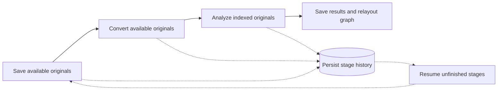

# Current architecture

## On-demand external agents

`desktop/agent-runtime.mjs` launches official Codex CLI / Claude Code processes. `scripts/local-service.js` routes search planning, paper analysis and research chat through one bounded queue. Each task carries its existing evidence/output contract; authentication remains with the user's CLI. See [on-demand execution](on-demand-agent.md) for cancellation, safety and limitations. Legacy manual MCP remains separate and cannot claim managed jobs.

_LitGraph 1.2.1 · Windows desktop architecture and the separate developer web preview_

---

## 📦 Components

The shared retrieval/download core is described in [scansci-integration.md](scansci-integration.md). Model-API workflows and authenticated external MCP tools use the same native local services. Only the necessary ScanSci WebVPN registry and URL-routing logic are retained; no Python runtime or additional download browser is required.

- `desktop/browser-verification.mjs`: stable-document checks, a 120-second manual wait budget, explicit-block detection and item-local skip errors. Timeout does not abort the import batch; user cancellation does.
- `desktop/main.mjs`: sandboxed Electron window, loopback HTTP service, authenticated IPC, encrypted model configuration, native model transport and persistent workspace state.
- `desktop/preload.cjs` / `src/desktop-bridge.js`: narrow renderer bridge; no Node access is exposed to page scripts. The renderer uses an in-memory browser partition; application state is restored from disk independently of its random loopback port.
- `desktop/metrics.mjs`: bounded offline queue for minimal launch/use events; disabled in development and automated tests.
- `cloudflare/metrics/`: optional operator-deployed Workers + D1 collector, HMAC installation IDs, idempotent events and private aggregate dashboard.
- `src/main.js`: application state, project library, graph rendering, windows and model requests.
- `src/model-rotation.js`: 3D pointer controller; viewpoint model rotation and year-tree camera navigation remain separate.
- `src/timeline-navigation.js`: fixed-heading year-tree panning and bounded upright orbit.
- `src/canvas-backgrounds.js`: cached procedural background artwork, used by Canvas 2D and a Three.js background texture.
- `src/discovery-contract.js`: provider-independent search planning, counts and strict filters.
- `src/import-jobs.js`: resumable, phase-based import work, one automatic attempt per stage and independent per-paper results.
- `src/durable-storage.js`: disk-backed desktop state with a quota-tolerant browser cache. Large project snapshots remain readable through the bridge even when they exceed localStorage capacity; unrelated storage retains normal browser semantics.
- `scripts/pdf-assets.js`: bundles and serves local PDF character maps, standard fonts, decoder resources and their notices. No remote font/CDN request is required for conversion.
- `desktop/institution.mjs`: isolated persistent institution browser session, real sign-in windows, authenticated acquisition and PDF inbox. Remote websites have neither Node nor application IPC access.
- `src/message-markdown.js`: Markdown rendering with an explicit safe HTML allowlist; executable content, embedded media and unsafe links are removed.
- `src/paper-analysis.js`: original-grounded summaries and classifications, with individual relationship-evidence validation.
- `scripts/scholarly-service.js`: paginated OpenAlex / Europe PMC / Crossref retrieval and metadata enrichment.
- `scripts/scansci-service.js`: compatibility facade joining native scholarly search, bounded OA acquisition and institution URL routing for both API and MCP workflows.
- `scripts/acquisition-core.js`: verified PDF locations first, official PMC alternatives and bounded article-page link extraction; 30-second OA budget, 12 seconds per candidate request, at most six candidate URLs and two simultaneous candidates.
- `scripts/institution-routing.js` / `vendor/scansci/`: Apache-2.0-attributed school gateway configuration, WebVPN AES-CFB URL conversion and explicit EZProxy templates. Registry presence is not proof of institution access.
- `scripts/public-fetch.js`: bounded HTTPS downloads with public-address validation, pinned DNS and redirect checks.
- `src/research-evidence.js`: paragraph/sentence chunks, metadata, exact source locations and citation-ID validation. Research uses `research-query.js` and `research-hybrid.js` for dual-level/multi-query planning, BM25+dense retrieval and feature reranking; `research-worker.js` runs the local multilingual embedding model. See [RAG and graph specification](RAG_AND_GRAPH.md) for implementation limits and scaling design.
- `src/research-agent.js`: source-grounded answer and follow-up-question contract.
- `src/summary-language.js`: language-specific summaries and faithful translation instructions.
- `scripts/local-service.js`: loopback-only authenticated search, PDF / Markdown storage, import snapshots and external Agent task queue.
- `scripts/litgraph-mcp.mjs`: STDIO MCP adapter to the local service. Desktop clients register once with `--connection-file`; each call discovers the current runtime address and credentials. Port changes are internal. A live adapter re-handshakes after an application restart, but unfinished model tasks are not replayed automatically. Explicit revocation remains effective until the user authorizes again.
- `vite.config.js`: development / preview middleware and public-versus-private sample resolution.

## 🔄 Data flow

Discovery: conditions and target count → configured model / Agent plans queries → local service retrieves real scholarly records → strict filtering / deduplication → source-ranked results without a second model call → user confirms → metadata enrichment → lawful PDF download → disk save → PDF.js text extraction → Markdown save → node original-file binding → source-backed citation edges between imported nodes. No model-native search tool is required.

For a new batch, originals are saved before conversion, and available Markdown is prepared before analysis compares related papers. On resume, already-converted items are analyzed first, so broken PDFs cannot block hundreds of ready documents. A successful stage flushes the workspace, project snapshot and history before starting another stage. Per-project disk writes are serialized to prevent overlapping conversion workers from overwriting a newer snapshot with an older one. Switching model providers changes the next model invocation, not the durable acquisition/conversion state. The progress control names the current phase and denominator; history retains all three totals while folded.

Redraw canvas sets `importCanvasHidden` only on incomplete nodes belonging to that history job. Visibility and layout exclude those nodes without deleting durable records or graph edges. Continue clears the flag for the same job. Collapsed history does not construct thousands of hidden detail rows. `tests/desktop-large-import.mjs` exercises a synthetic 1,519-node workspace larger than the browser cache quota, redraw, restart, Continue and pause without real model calls or user files.

Research: freeze the selected paper scope → load source text / Markdown → chunk and rank relevant excerpts → send excerpts, per-paper coverage and question → validate response → display answer and three specific follow-up questions.

A summary alone is not full text. No source text is fabricated when a download fails. PDF retrieval goes through the authenticated local service, not a cross-origin browser fetch. Authentication, unavailable URLs, download restrictions or scanned files can still require manual import / OCR.

PDF text validation distinguishes widespread Unicode corruption from isolated undecodable formula/table glyphs. Readable pages are preserved; ambiguous glyphs become `[unmapped PDF symbol]` with a per-page extraction note. Their missing meaning is never guessed. Research must not derive numerical claims from affected expressions, and candidate relationships quoting these markers are rejected. Rejected edges do not discard a valid paper node, summary or classification; history exposes validation reasons.

**Reset all settings** removes API credentials, external-agent pairing, institution sign-in/portal settings and interface preferences. It retains projects, original files, Markdown, analyses, vectors, graph JSON, conversations and import history. It uses an explicit preference-key list, never a blanket data-directory or browser-storage clear. **Delete configuration** in Method 1 removes only the API configuration. Desktop credentials are removed from the OS-encrypted configuration file as well as the interface. Active work must be paused or completed first.

OA acquisition reuses already verified source PDF locations before additional metadata lookup. The first complete PDF ends the candidate race and cancels losing requests. Missing, denied or timed-out sources produce a per-paper result; they do not trigger an unbounded upstream all-source/browser race. Original saving, conversion and analysis remain separately resumable.

In institution mode, failed OA acquisition can fall back to the desktop institution session. Each path has a separate 30-second budget, so a paper needing both can use approximately 60 seconds of active acquisition before conversion/analysis, excluding user authentication waiting time. Verification opens the preserved institution page in the foreground and holds the shared acquisition queue until the user completes authentication and saves the session. Each source candidate is attempted once within its stage; different verified URLs are alternatives, not repeated whole-stage retries. The same isolated Electron session owns both the user-visible sign-in window and automatic requests; browser cookies are not copied into Python or an external Agent. Recognized WebVPN hosts and explicitly configured EZProxy templates route the article through its actual institution entry. Ordinary library homepages, expired sessions and subscription restrictions cannot be treated as confirmed access. Web preview has the OA local service but no Electron institution browser/session.

## 💾 Storage

| Content | Current location |
| --- | --- |
| Project library, settings, conversation state | Desktop: `workspace-state.json` mirrored from renderer storage; web preview: browser localStorage |
| Original PDFs | `data/originals/<document-hash>.pdf`; saved before conversion |
| PDFs received from institution pages | `data/incoming/<receipt-id>.pdf`; retained while a project receives them or the user chooses manual handling |
| Converted original text | `data/markdown/<document-hash>.md` |
| Document identity, paths and source metadata | `data/records/<document-hash>.json` |
| Verified search records and processing history | `data/records/discovery-records.json` and `discovery-history.json` |
| Project snapshots | `data/projects/<project-hash>.json` |
| Summaries, classifications and graph relationships | `data/analysis/<project-hash>.json` |
| Computed graph-layout vectors | `data/vectors/<project-hash>.json`; populated only with actual computed vectors |
| Temporary original / text cache | IndexedDB and in-memory cache; disk records remain authoritative for resume |
| API configuration | Desktop: Electron safeStorage / Windows encryption in `model-config.encrypted`; web preview: browser localStorage |
| Institution session | Persistent isolated Chromium partition plus `institution-session.encrypted` cookie snapshot; inaccessible to models and MCP tools |
| Basic telemetry | Desktop `metrics-state.json`; remote HMAC installation records and daily aggregates, no research content |
| External Agent tasks and tokens | Local service memory; page/session scoped |
| Public sample | `src/public-sample.js` and `src/sample-project.json`, 50 public bibliographic records |

The desktop root is the current user's Electron userData directory (normally `%APPDATA%\litgraph`), not the read-only installation directory or ASAR archive. Settings → Data folder opens its `data/` directory through the operating system. Main-process workspace persistence restores projects on restart even when the loopback port changes. API configuration is excluded from project snapshots; encryption failure does not fall back to plaintext. Document hashes use the project ID and node ID; project hashes use the project ID. Paths are derived from validated identifiers beneath the current data root, not trusted from arbitrary exported paths.

Legacy documents under `projects/local-fulltext-index/` migrate by copying on first read; original legacy files are retained. Legacy history and search catalogs remain readable from `projects/discovery-*.json` until the next save writes the categorized location. Users do not need to manually move old files. A project JSON export is not a full backup: close the app and back up the full user-data root, including `data/` and `workspace-state.json`. Encrypted credentials may require reconfiguration on another Windows account or computer.

For the web preview only, a different origin, port or cleared browser storage may hide projects; restore a JSON export when necessary. Import snapshots are not a complete backup of every later project edit.

## 🔐 Desktop and external Agent boundary

The main window has context isolation, sandboxing and no Node integration. IPC checks the sending window, main frame and local origin. Model transport accepts HTTPS and loopback HTTP, rejects embedded credentials and redirects, limits request/response sizes, and supports cancellation. Original files are opened by the operating system using a validated index key resolved inside the user data directory. Missing file associations invoke the system application picker. In-app document popups are denied; web links open externally. The local file/download service retains browser/Agent token separation and public-address checks. The desktop starts maximized, with a draggable native titlebar region excluding its control buttons.

Discovery persists search snapshots and per-paper acquisition, conversion and analysis stages in `data/records/discovery-history.json`. Verified source records in `data/records/discovery-records.json` support resumed acquisition after a new page session. Resume reconciles existing disk files, skips completed stages and retries unfinished work. Closing either floating tool window does not cancel the queue while the application stays open. Explicit pause cancels active work and preserves completed stages; exiting the application requires resuming after restart.

Analysis reads bounded original excerpts plus up to six indexed peer originals. Required summary/classification fields must be valid. Each proposed relationship is checked independently against both supplied originals. Layout-only Unicode, whitespace and line-wrap differences are normalized; paraphrases and translations do not count as quotations. An unsupported edge is discarded and recorded as a warning without discarding a valid summary, classification or other verified edges. Metadata-backed citation edges are generated separately. A readable Markdown file does not guarantee model completion: network failures, missing model access, invalid required fields and timeouts can still leave analysis pending. Draft filter changes do not invalidate submitted results.

The native clipboard bridge accepts only bounded plain-text writes from the trusted main application frame. It avoids browser focus restrictions when asynchronous Agent instructions are ready. Browser preview tries its standard clipboard API and a selectable-text fallback; it does not report success if both fail. The data-folder action can open only the fixed categorized folder, not an arbitrary path supplied by the renderer.

MCP uses the installed runtime in Node mode (`ELECTRON_RUN_AS_NODE=1`) with an adapter copied into `agent-guide/`. The connection instructions provide the actual executable, environment, endpoint and per-session token. The external Agent must perform a handshake and keep polling/fulfilling tasks. Installed users do not need a separate Node runtime. Model API calls do not trigger the external Agent confirmation dialog.

## 📦 Release boundary

All `projects/` content is private and ignored. Development and production use the same sanitized 50-paper sample. A fresh installation opens a blank project; the sample is optional. No full-text originals, personal paths, model credentials or local preferences are bundled. Optional local full-text fallback uses `projects/local-sample/graph.json` and is never published.

The unsigned NSIS installer packages the app, renderer, native acquisition/routing core, pinned WebVPN registry, local service and Agent contracts. Desktop preparation validates the required core assets and retains vendor attribution alongside dependency notices. Python development environments and upstream proprietary binaries are not packaged. Private profiles, originals, tests, keys and operator Cloudflare secrets are excluded through a packaging allowlist. See `PRIVACY.md` and `docs/metrics.md` for telemetry and retained preferences. The About dialog contains product information and the installed version; it no longer contains a telemetry switch. Saved opt-out preferences remain effective.

Saved graph-layout vectors support reproducibility of the existing semantic layout. They are not a learned embedding model or a vector database for full-text retrieval. No OCR pipeline, universal school/SSO automation, automatic updates or sharing of cookies with the user's unrelated system browsers is implemented. Supported institution routing reuses only the application's own authenticated institution session.
